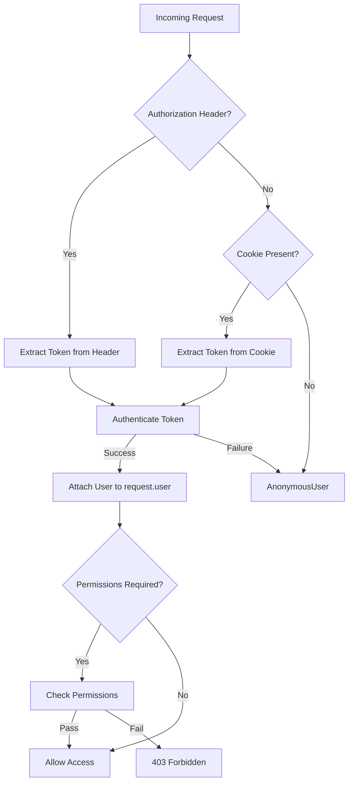

# Authentication & Authorization Workflow

This document describes the authentication and authorization workflow for both human users (browser-based, cookie authentication) and machine clients (API, token-based) in this project.

---

## Overview

Authentication and authorization are handled differently depending on the type of client:

- **Humans (Browser/Interactive):**
  - Authenticate via login form; session is maintained using HTTP-only cookies (typically `access_token`).
  - All subsequent requests from the browser include the cookie automatically.
  - Used by the frontend (Vue 3, Pinia store) and Django backend.

- **Machines (API Clients/Scripts):**
  - Authenticate by sending a JWT token in the `Authorization` header (`Authorization: Bearer <token>`).
  - Used for programmatic access, SDKs, and automated integrations.

---

## Backend (Django, Ninja, JWT)

### Authentication Middleware
- Located in: `api/auth/middleware.py`
- Custom `JWTAuth` class extends `ninja_jwt.authentication.JWTAuth`.
- **Token Extraction Logic:**
  1. Checks for `Authorization` header (`Bearer <token>`).
  2. If not present or set to `undefined`, falls back to `access_token` cookie.
  3. If neither is present, treats the user as anonymous.
- **User Assignment:**
  - On successful authentication, attaches the user to `request.user`.
  - On failure, logs the error and assigns `AnonymousUser`.
- **Authorization:**
  - Uses permission classes (e.g., `StaffOnly`, `AuthenticatedOnly`, etc.) to restrict access to endpoints.
  - Permissions are checked after authentication; if denied, a 403 error is raised.

#### Example Middleware Flow

---

## Frontend (Vue 3, Pinia Store)

- Located in: `ui/stores/auth.ts`
- **Login:**
  - Calls backend login endpoint; receives and stores authentication cookie.
  - After login, fetches user data (`whoami`) and updates the Pinia store.
- **Session Persistence:**
  - On page load or navigation, attempts to fetch user data using the cookie (if present).
  - If not authenticated, resets user state.
- **Logout:**
  - Calls backend logout endpoint; clears user data and redirects to home.
- **Machine Auth:**
  - For API clients, tokens can be set in the `Authorization` header (handled by the auto-generated API client).

---

## Summary Table

| Client Type | Auth Method         | Token Location         | Backend Extraction Priority |
|-------------|--------------------|------------------------|----------------------------|
| Human       | Cookie (browser)   | `access_token` cookie  | 2                          |
| Machine     | Bearer Token (API) | `Authorization` header | 1                          |

---

## References
- Backend Middleware: [`api/auth/middleware.py`](api/auth/middleware.py)
- Frontend Auth Store: [`ui/stores/auth.ts`](ui/stores/auth.ts)

---

For further details, see the code comments and implementation in the referenced files. 