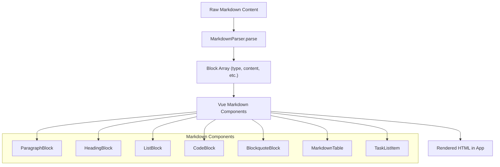

# Frontend Documentation

## Project Structure

This section describes the structure of the **frontend** (`ui/`) directory. For the backend, see the [Backend Documentation](./backend.md) and the `api/` directory.

The `ui/` directory is organized for clarity, maintainability, and scalability. Key folders include:

- **components/**: Reusable Vue components, including UI elements, markdown blocks, and layout pieces.
- **composables/**: Vue composables (composition API utilities) for shared logic (e.g., API client, file upload, etc.).
- **stores/**: Pinia stores for state management (e.g., authentication, user data). Includes `__tests__/` for store unit tests.
- **pages/**: Route-based Vue components for each page in the app (organized by feature or section).
- **assets/**: Static assets such as images, fonts, and global CSS.
- **lib/api/**: Auto-generated TypeScript API client from the backend OpenAPI schema. Do not edit manually—regenerate with `task generate-sdk`.
- **e2e/**: End-to-end Playwright tests for user flows and UI validation.
- **layouts/**: App layout components (headers, footers, etc.).
- **public/**: Publicly served static files.
- **test-results/**: Output from test runs (e.g., Playwright, Vitest).

This structure supports modular development, easy testing, and clear separation of concerns. For more details, see the README or explore each folder.

## State Management

State management in the frontend is handled using **Pinia**, the official Vue store library. All stores are located in [`ui/stores`](../ui/stores).

- **Pinia Stores:** Each store manages a specific domain of app state (e.g., authentication, user data, etc.).
- **SSR Hydration:** Stores support server-side rendering hydration/dehydration via `dehydrate` and `hydrate` methods, ensuring state is preserved between server and client.
- **Testing:** Stores are unit tested with Vitest (see [`ui/stores/__tests__`](../ui/stores/__tests__)).
- **Example:** The [`auth.ts`](../ui/stores/auth.ts) store manages authentication state, login/logout, and user profile updates.

For more details, see the code and tests in the `ui/stores` directory.

## API Usage

All API usage in the frontend is handled via:

- **Auto-generated TypeScript client**: Located in [`ui/lib/api`](../ui/lib/api), this client is generated from the backend's OpenAPI schema and provides strongly-typed access to all API endpoints (e.g., `AccountsApi`, `PostsApi`, `SeriesApi`, etc.).
  - **SDK updates:** When backend API endpoints change, regenerate the SDK by running `task generate-sdk` from the project root. This ensures the frontend stays in sync with the backend API.
- **API Client Composable**: The [`useApiClient.ts`](../ui/composables/useApiClient.ts) composable is used to instantiate API clients with the correct configuration and authentication context. Always call `useApiClient` close to where the API client is needed (e.g., inside a method or effect), not at the top level of a component, to ensure the auth token is current.
- **Direct fetch for file uploads:** In rare cases, such as file uploads ([`useFileUpload.ts`](../ui/composables/useFileUpload.ts)), direct `fetch` is used instead of the SDK due to a known bug in openapi-generator's `typescript-fetch` with file handling.

**Example usage:**
```ts
import { AccountsApi } from '@/lib/api'
import { useApiClient } from '@/composables/useApiClient'

async function fetchUser() {
  const api = useApiClient(AccountsApi)
  const user = await api.whoami()
  // ...
}
```

For more details, see the code and JSDoc comments in [`ui/composables/useApiClient.ts`](../ui/composables/useApiClient.ts), [`ui/composables/useFileUpload.ts`](../ui/composables/useFileUpload.ts), and the generated API modules in [`ui/lib/api/apis/`](../ui/lib/api/apis/).

## Styling

Styling in the frontend is managed through:

- **TailwindCSS**: Utility-first CSS framework, configured in [`ui/tailwind.config.ts`](../ui/tailwind.config.ts). This file defines the color palette (including custom primary and surface colors), typography, and other design tokens. Tailwind's plugin system (e.g., `@tailwindcss/typography`) is also used for rich text formatting.
- **PrimeVue**: UI component library used throughout the app, providing accessible, customizable components. The base Aura theme is used for a modern, consistent look and feel. For more details on theming and design tokens, see the [PrimeVue Styled Theming documentation](https://primevue.org/theming/styled/).
- **Global CSS**: Additional variables and base styles are defined in [`ui/assets/base.css`](../ui/assets/base.css). This file sets up CSS custom properties for colors, border radii, and text, and provides both light and dark mode support using the `prefers-color-scheme` media query.
- **Component Styles**: Scoped styles in Vue components for fine-tuned UI adjustments.

This approach ensures a consistent, themeable, and responsive design across the application, with easy support for dark mode and custom branding.

---

## Markdown Editor & Parser

The app features a powerful, custom-built Markdown editing and rendering experience, composed of:

- **MarkdownEditor.vue** (`ui/components/MarkdownEditor.vue`)
- **MarkdownParser.ts** (`ui/services/MarkdownParser.ts`)

### Key Features

- **Rich Toolbar:** Bold, italic, code, headings, links, images, code blocks, lists (ordered, unordered, checklists), and more.
- **Live Preview:** Side-by-side split view with real-time markdown rendering.
- **Syntax Highlighting:** Code blocks are highlighted using Highlight.js.
- **Drag-and-Drop Uploads:** Drag files/images into the editor to upload and insert markdown links automatically.
- **Paste Support:** Paste URLs or images directly; smart link formatting.
- **Task Lists:** Support for GitHub-style checklists (`- [ ] Task`, `- [x] Done`).
- **Responsive & Expandable:** Editor can be expanded to fullscreen for distraction-free writing.
- **Custom Parsing:** `MarkdownParser.ts` provides block-level parsing for advanced features (tables, blockquotes, lists, etc.).
- **Extensible:** Easily add new toolbar actions or parsing rules.

### Markdown Rendering Components

Markdown content is rendered using a set of dedicated Vue components in `ui/components/markdown/`. Each block type (e.g., paragraph, heading, list, code block, table, blockquote, task list item) has its own component, allowing for:

- **Consistent formatting** and styling across the app.
- **Easy customization** of how each markdown element appears.
- **Extensibility**: Add new block types or override existing ones as needed.

**Key components include:**
- `ParagraphBlock.vue`
- `HeadingBlock.vue`
- `ListBlock.vue`
- `TaskListItem.vue`
- `CodeBlock.vue`
- `BlockquoteBlock.vue`
- `MarkdownTable.vue`
- ...and more.

These components are used by the markdown parser and renderer to turn parsed markdown blocks into rich, styled Vue components.

### Parser Flow Diagram

The following diagram illustrates how the `MarkdownParser` processes markdown content and how the resulting blocks are rendered:



### Usage

- **Component:** Use `<MarkdownEditor v-model="content" :post-id="postId" />` in your forms or pages.
- **Parser:** Import and use `MarkdownParser` for custom rendering or processing of markdown content.

### Code Locations
- Editor UI: [`ui/components/MarkdownEditor.vue`](../ui/components/MarkdownEditor.vue)
- Parser Service: [`ui/services/MarkdownParser.ts`](../ui/services/MarkdownParser.ts)
- Markdown Components: [`ui/components/markdown/`](../ui/components/markdown/)

### Extending
- Add new toolbar buttons by editing the toolbar slot in `MarkdownEditor.vue`.
- Extend parsing logic by modifying or subclassing `MarkdownParser.ts`.
- Add or customize markdown rendering components in `ui/components/markdown/`.

---

For more details, see the code comments and examples in the referenced files. 