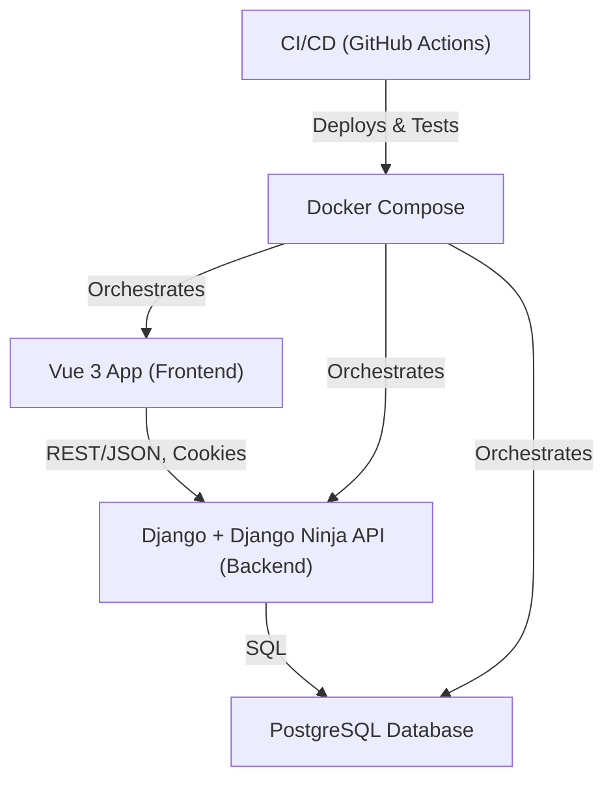

# Project Overview

## Project Purpose & Goals

This project is a modern, full-stack web application designed to provide a robust, scalable, and maintainable platform for content management and publishing. It aims to deliver a seamless experience for both end-users and administrators, with a focus on security, developer productivity, and extensibility.

## High-Level Architecture Diagram

## Key Technologies

- **Backend:** Python, Django, Django Ninja, Poetry
- **Frontend:** Vue 3, Vite, TypeScript, Pinia, PrimeVue, TailwindCSS
- **Database:** PostgreSQL
- **DevOps:** Docker, Docker Compose, GitHub Actions
- **Testing:** Pytest, Vitest, Playwright

## Main Features (Platform)

- User authentication (JWT, cookies, permissions)
- RESTful API with OpenAPI schema and auto-generated TypeScript client
- Admin and user interfaces
- Automated testing (unit, integration, E2E)
- CI/CD pipeline for quality and deployment
- Modular, extensible codebase

## App Features (User-Facing)

- **Posts:** Create, edit, publish, and manage blog posts
- **Series:** Group posts into series for multi-part content
- **Sharecodes:** Generate and use shareable codes for content access or collaboration
- **Markdown Editor:** Rich markdown editing experience with preview and formatting tools. **Supports Mermaid diagrams in markdown code blocks.**
- **Media Management:** Upload and manage images/files for posts
- **Commenting:** User comments on posts (if enabled)
- **User Profiles:** Manage account details and profile information
- **Admin Dashboard:** Advanced admin UI for managing users, posts, series, and more
- **Search & Filtering:** Find posts by tags, series, or keywords
- **Responsive UI:** Mobile-friendly, accessible design 